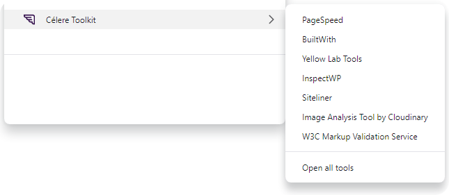

# Célere Toolkit

Acesse facilmente ferramentas de análise de web performance através do menu de contexto em navegadores baseados em Chromium.

> [!IMPORTANT]
> Cada ferramenta possui suas próprias políticas de acesso: limite de requisições, bloqueio de IPs ou VPNs, e requisitos de login em algumas funcionalidades. Para evitar problemas de acesso, utilize as ferramentas de forma moderada e consulte as políticas diretamente nos sites quando necessário.

## Ferramentas

- [PageSpeed](https://pagespeed.web.dev/)
- [BuiltWith](https://builtwith.com/)
- [Yellow Lab Tools](https://yellowlab.tools/)
- [InspectWP](https://inspectwp.com/en)
- [Siteliner](https://www.siteliner.com/)
- [Image Analysis Tool by Cloudinary](https://webspeedtest.cloudinary.com/)
- [W3C Markup Validation Service](https://validator.w3.org/)

## Instalação

- [Faça o download do arquivo](https://github.com/Celere-WP/celeridade/releases).
- Extraia o arquivo ZIP.
- Abra o navegador baseado em Chromium e vá para `chrome://extensions`.
- Ative o "Modo Desenvolvedor" (localizado no canto superior direito).
- Clique no botão "Carregar sem compactação" (localizado no canto superior esquerdo).
- Navegue até o diretório onde você extraiu o arquivo ZIP contendo a extensão.
- Selecione a pasta da extensão.

## Uso

No site que deseja analisar, clique com o botão direito em qualquer área da página para acessar o menu; uma nova aba será aberta na ferramenta selecionada e a análise começará automaticamente.

> [!NOTE]
> A análise feita pela ferramenta **Image Analysis Tool by Cloudinary** leva alguns segundos para iniciar; após selecioná-la no menu, aguarde.
